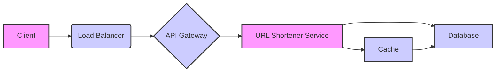

# Ace Your System Design Interview: A Comprehensive Guide with Examples

System design interviews are notoriously challenging. They assess your ability to think critically, design scalable systems, and communicate effectively. This guide provides a comprehensive approach to tackling these interviews, covering everything from understanding the problem to presenting your solution. We'll break down the process into manageable steps, complete with examples and practical tips.

## Understanding the Problem: The Foundation of Success

Before diving into the technical details, it's crucial to fully grasp the problem.  Start by clarifying the requirements and asking clarifying questions.  Don't assume anything!

**1. Clarify Requirements & Scope:**

*   **What is the core functionality?** What is the system supposed to do?
*   **Who are the users?** What are their expected behaviors and needs?
*   **What are the performance requirements (QPS, latency, storage)?** Understanding these key metrics upfront will guide your design choices.
*   **What are the constraints?** Are there any limitations regarding budget, technology, or time?
*   **What features are in scope, and what are out of scope (for now)?**  This helps to define the boundaries of the problem.
*   **What are the use cases with the highest frequency?** Optimizing for these will provide the most impact.

**Example Questions:**

*   "Could you elaborate on the expected scale of users and data?"
*   "What is the target latency for the core functionality?"
*   "Are there any specific technologies or cloud providers we need to consider?"
*   "What are the most important use cases to optimize for?"

**Why is this important?**  Misunderstanding the requirements can lead to a completely irrelevant design.  Taking the time to clarify ensures you and the interviewer are on the same page.

## High-Level Design: Painting the Big Picture

Once you understand the requirements, start with a high-level design. This should be a simple diagram that outlines the major components of your system and how they interact.

**1. Identify Key Components:**

*   **Client:**  The user interface (web, mobile, etc.)
*   **Load Balancer:** Distributes traffic across servers.
*   **API Gateway:**  Handles requests and routes them to the appropriate services.
*   **Application Servers:**  Process the business logic.
*   **Database:**  Stores the data.
*   **Cache:**  Improves performance by storing frequently accessed data.
*   **Message Queue:**  Enables asynchronous communication between services.

**2. Create a Diagram:**

Use a tool like Excalidraw, draw.io, or even a whiteboard to create a visual representation of your system.  Keep it clean and easy to understand.

**Example:**

Let's say the problem is to design a URL Shortener like bit.ly. A high-level diagram might look like this:



**3. Explain Your Choices:**

Clearly articulate why you chose these components and how they work together. Focus on the data flow and the roles of each component.

**Example Explanation:**

"Clients send requests to the Load Balancer, which distributes traffic evenly across the API Gateway. The API Gateway then routes the requests to the URL Shortener Service.  The service checks the Cache first. If the shortened URL isn't found, it queries the Database, shortens the URL, stores it in the database and cache and returns it to the client. We use a cache for frequently accessed URLs to improve performance."

**Why is this important?**  The high-level design provides a foundation for the rest of the interview. It demonstrates your ability to think strategically and identify the core components of a system.

## Deep Dive: Component-Level Design

Now, choose one or two key components and delve deeper into their design.  Consider the following aspects:

**1. Data Model:**

*   **What data will be stored?**  Define the schema for your database tables.
*   **What are the relationships between entities?**  How will you model these relationships in your database?
*   **Consider data types and sizes.**  Optimize for storage and performance.

**Example: URL Shortener Data Model**

```
Table: Urls

Columns:
  id (BIGINT, Primary Key, Auto-Increment)
  original_url (VARCHAR(2048), Index)
  shortened_url (VARCHAR(255), Unique Index)
  creation_date (TIMESTAMP)
  expiration_date (TIMESTAMP, nullable)
  user_id (BIGINT, nullable, Foreign Key)
```

**2. API Design:**

*   **Define the APIs for your service.**  What endpoints will you expose?
*   **Consider request and response formats (JSON, Protobuf).**
*   **Think about authentication and authorization.**

**Example: URL Shortener API**

*   **POST /api/shorten:**  Shorten a URL.
    *   Request: `{ original_url: "https://www.example.com" }`
    *   Response: `{ shortened_url: "http://short.url/xyz" }`
*   **GET /{shortened_url}:**  Redirect to the original URL.
    *   Request: `http://short.url/xyz`
    *   Response: 302 Redirect to `https://www.example.com`

**3. Algorithms and Data Structures:**

*   **What algorithms will you use to process the data?**
*   **Choose appropriate data structures for storage and retrieval.**
*   **Consider the time and space complexity of your algorithms.**

**Example: URL Shortening Algorithm**

A common approach is to use a base-62 encoding (a-z, A-Z, 0-9) to generate unique shortened URLs.

```python
import base62

def shorten_url(url_id):
  """Shortens a URL ID using base62 encoding."""
  return base62.encode(url_id)

def expand_url(shortened_url):
  """Expands a shortened URL using base62 decoding."""
  return base62.decode(shortened_url)

# Example Usage
url_id = 123456789
shortened_url = shorten_url(url_id)
print(f"Shortened URL for ID {url_id}: {shortened_url}")

expanded_url_id = expand_url(shortened_url)
print(f"Expanded URL ID for {shortened_url}: {expanded_url_id}")
```

**4. Scalability and Performance:**

*   **How will your component handle increased load?**
*   **Consider caching, load balancing, and database sharding.**
*   **Identify potential bottlenecks and how to mitigate them.**

**Example: Scaling the URL Shortener**

*   **Caching:** Use a cache (like Redis or Memcached) to store frequently accessed URL mappings.
*   **Database Sharding:**  Partition the database based on the URL ID to distribute the load across multiple servers.
*   **Read Replicas:** Use read replicas to handle read requests and reduce the load on the primary database.
*   **Load Balancing:** Distribute incoming requests across multiple instances of the URL Shortener Service.

**5. Reliability and Fault Tolerance:**

*   **How will your component handle failures?**
*   **Consider redundancy, backups, and monitoring.**
*   **Implement health checks and automatic failover mechanisms.**

**Example: Ensuring Reliability**

*   **Replication:** Use database replication to provide redundancy.  If the primary database fails, a replica can take over.
*   **Health Checks:** Implement health checks for each service to automatically detect failures.
*   **Automatic Failover:**  Configure the load balancer to automatically redirect traffic to healthy instances if one fails.
*   **Monitoring:** Monitor key metrics (CPU usage, memory usage, latency, error rates) to detect and diagnose problems quickly.

**Why is this important?**  This deep dive demonstrates your understanding of the technical challenges involved in building real-world systems. It also showcases your ability to make informed design choices based on specific requirements and constraints.

## Addressing Constraints and Trade-offs: The Art of Compromise

System design is often about making trade-offs. There is rarely a perfect solution.  Be prepared to discuss the constraints of your design and the trade-offs you made.

**1. Identify Potential Bottlenecks:**

*   **Where are the single points of failure?**
*   **Where are the performance bottlenecks?**
*   **What are the scalability limitations?**

**2. Evaluate Trade-offs:**

*   **Consistency vs. Availability (CAP Theorem):** Choose the right balance for your application.
*   **Latency vs. Throughput:** Optimize for the desired performance characteristics.
*   **Cost vs. Performance:** Consider the cost implications of different design choices.

**3. Discuss Alternative Solutions:**

*   **Be prepared to discuss alternative approaches and their pros and cons.**
*   **Show that you've considered different options and made a reasoned decision.**

**Example Trade-off Discussion:**

"For the URL Shortener, we could choose to prioritize consistency over availability. In this case, we would ensure that all writes are immediately replicated to all replicas before returning a success response. However, this would increase latency. Alternatively, we could prioritize availability, allowing writes to be asynchronous and potentially leading to temporary inconsistencies. This would improve latency but at the cost of data consistency.  Given the nature of URL shortening, availability is generally more important, so we might choose to prioritize availability."

**Why is this important?**  Demonstrating your awareness of trade-offs shows that you understand the complexities of system design and can make informed decisions based on specific requirements.

## Communication and Presentation: Selling Your Solution

The final, and arguably most important, part of the interview is your ability to communicate your design effectively.

**1. Be Clear and Concise:**

*   **Use clear and unambiguous language.**
*   **Avoid jargon unless necessary.**
*   **Structure your explanation logically.**

**2. Draw Diagrams:**

*   **Use diagrams to illustrate your design.**
*   **Keep diagrams simple and easy to understand.**
*   **Walk the interviewer through the diagrams step by step.**

**3. Justify Your Choices:**

*   **Explain why you made specific design choices.**
*   **Highlight the advantages and disadvantages of your approach.**
*   **Address potential concerns proactively.**

**4. Engage with the Interviewer:**

*   **Ask questions to clarify requirements.**
*   **Encourage feedback and discussion.**
*   **Be open to alternative solutions.**

**5. Practice, Practice, Practice:**

*   **Practice explaining your designs to friends, colleagues, or even yourself.**
*   **Record yourself and identify areas for improvement.**
*   **Participate in mock interviews.**

**Why is this important?**  Even the best design is useless if you can't communicate it effectively.  A clear and concise presentation will help the interviewer understand your thought process and appreciate the strengths of your solution.

## Key Takeaways

*   **Clarify Requirements:** Understand the problem thoroughly before you start designing.
*   **Start with a High-Level Design:**  Create a simple diagram that outlines the major components of your system.
*   **Deep Dive into Key Components:** Choose one or two components and delve deeper into their design.
*   **Address Constraints and Trade-offs:** Be prepared to discuss the limitations of your design and the trade-offs you made.
*   **Communicate Effectively:**  Explain your design clearly and concisely.

By following these guidelines, you can significantly improve your chances of success in system design interviews. Remember that practice is key.  The more you practice, the more comfortable and confident you'll become. Good luck!