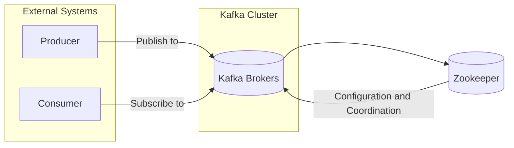

# Apache Kafka: A Deep Dive into Distributed Streaming and Real-Time Data Processing

In today's data-driven world, the ability to process and analyze data in real-time is crucial for businesses to stay competitive. Apache Kafka, a distributed streaming platform, has emerged as a leading solution for building robust and scalable real-time data pipelines and streaming applications. This comprehensive guide will delve into the core concepts of Kafka, its architecture, and practical examples of how to use it.

## What is Apache Kafka?

Apache Kafka is an open-source, distributed, fault-tolerant streaming platform developed by LinkedIn and subsequently donated to the Apache Software Foundation. It is designed to handle high-throughput data streams from multiple sources and deliver them to multiple destinations with low latency. Think of it as a highly scalable and reliable message broker optimized for real-time data.

Kafka offers several key advantages:

- **Scalability:** Kafka can handle massive amounts of data and scale horizontally by adding more brokers to the cluster.
- **Fault Tolerance:** Kafka replicates data across multiple brokers, ensuring data availability even in the event of broker failures.
- **High Throughput:** Kafka can process millions of messages per second with minimal latency.
- **Durability:** Kafka persists data to disk, guaranteeing data durability and preventing data loss.
- **Real-Time Processing:** Kafka enables real-time data processing and analysis, allowing businesses to make informed decisions quickly.

## Kafka Architecture: Understanding the Key Components

To effectively utilize Kafka, it's essential to understand its key architectural components:

- **Topics:** A topic is a category or feed name to which records are published. Think of it as a named data stream. Kafka topics are partitioned for scalability and parallelism.
- **Partitions:** Each topic is divided into one or more partitions. Each partition is an ordered, immutable sequence of records that is continually appended to. The number of partitions is a crucial configuration that impacts throughput and parallelism.
- **Brokers:** Brokers are the servers that make up the Kafka cluster. They are responsible for storing and managing data. Kafka clusters typically consist of multiple brokers for redundancy and scalability. A broker stores one or more partitions of different topics.
- **Producers:** Producers are applications that publish (write) data to Kafka topics. They are responsible for serializing and sending data to the appropriate topic and partition.
- **Consumers:** Consumers are applications that subscribe to Kafka topics and consume (read) data from them. They are responsible for deserializing data and processing it. Consumers often belong to consumer groups for parallel consumption.
- **Zookeeper:** While Kafka versions 3.x and later are moving away from Zookeeper, traditionally, Zookeeper manages the Kafka cluster configuration, elects leaders for partitions, and monitors the health of brokers. It is responsible for coordinating the Kafka cluster.
- **Kafka Connect:** Kafka Connect is a framework for connecting Kafka with external systems, such as databases, file systems, and other message queues. It simplifies the process of importing and exporting data from Kafka.
- **Kafka Streams:** Kafka Streams is a client library for building stream processing applications on top of Kafka. It allows you to perform real-time data transformations, aggregations, and joins on data streams.

Here's a simplified diagram illustrating the Kafka architecture:



## Kafka Concepts in Detail

Let's delve deeper into some of the critical concepts:

- **Topics and Partitions:** Topics are logical categories, and partitions are physical segments of those categories. A message within a partition has an offset, which is a sequential ID number uniquely identifying its position within the partition. Partitioning allows Kafka to distribute the load across multiple brokers, enhancing throughput. The order of messages is only guaranteed within a single partition.

- **Replication:** Kafka replicates each partition across multiple brokers, typically configured using a _replication factor_. One broker is elected as the _leader_ for a partition, and the others are _followers_. All reads and writes go through the leader. If the leader fails, one of the followers is automatically elected as the new leader, ensuring high availability.

- **Consumer Groups:** Consumers are organized into consumer groups. Each consumer within a group is assigned one or more partitions from a topic. Kafka ensures that each message in a partition is only consumed by one consumer within a group. This allows for parallel processing of messages across multiple consumers. If a consumer group has more consumers than partitions, some consumers will be idle. If a consumer group has fewer consumers than partitions, some consumers will handle multiple partitions.

- **Offsets:** Consumers track their progress by maintaining an offset for each partition they are consuming. The offset represents the last message consumed. Consumers can commit their offsets to Kafka, ensuring that they can resume consumption from where they left off in case of a failure. Offset management is crucial for ensuring at-least-once or exactly-once delivery semantics.

## Practical Examples: Kafka in Action

Let's explore some practical examples of using Kafka with Python using the `kafka-python` library. First, install the library:

```plaintext
pip install kafka-python
```

### 1. Producing Messages

```plaintext
from kafka import KafkaProducer
import json

# Configure the Kafka producer
producer = KafkaProducer(
    bootstrap_servers=['localhost:9092'],  # Replace with your Kafka broker addresses
    value_serializer=lambda x: json.dumps(x).encode('utf-8')  # Serialize messages to JSON
)

# Produce messages to a topic
topic_name = 'my_topic'
for i in range(10):
    message = {'message': f'Hello, Kafka! Message number: {i}'}
    producer.send(topic_name, value=message)
    print(f"Sent: {message}")

# Flush the producer to ensure all messages are sent
producer.flush()
producer.close()
```

**Explanation:**

- The code creates a `KafkaProducer` instance, specifying the Kafka broker address and a serializer to convert Python dictionaries to JSON strings.
- It then iterates 10 times, creating a message dictionary in each iteration.
- The `producer.send()` method sends the message to the specified topic.
- `producer.flush()` ensures that all buffered messages are sent to the broker before the producer is closed.
- `producer.close()` closes the producer connection.

### 2. Consuming Messages

```plaintext
from kafka import KafkaConsumer
import json

# Configure the Kafka consumer
consumer = KafkaConsumer(
    'my_topic',  # Replace with your topic name
    bootstrap_servers=['localhost:9092'],  # Replace with your Kafka broker addresses
    auto_offset_reset='earliest',  # Start consuming from the beginning if no offset is found
    enable_auto_commit=True,      # Automatically commit offsets
    group_id='my_group',         # Consumer group ID
    value_deserializer=lambda x: json.loads(x.decode('utf-8'))  # Deserialize messages from JSON
)

# Consume messages from the topic
try:
    for message in consumer:
        print(f"Received: {message.value}")
except KeyboardInterrupt:
    print("Stopping consumer...")
finally:
    consumer.close()
```

**Explanation:**

- The code creates a `KafkaConsumer` instance, specifying the topic to consume from, the Kafka broker address, and a deserializer to convert JSON strings back to Python dictionaries.
- `auto_offset_reset='earliest'` configures the consumer to start consuming from the beginning of the topic if no offset is found. Other options include `'latest'` to only consume new messages.
- `enable_auto_commit=True` automatically commits offsets to Kafka, simplifying offset management.
- `group_id='my_group'` assigns the consumer to a specific consumer group.
- The `for message in consumer:` loop iterates through the received messages.
- The `message.value` attribute contains the deserialized message data.
- The `consumer.close()` method closes the consumer connection.

### 3. Producing and Consuming with Key

Kafka messages can have optional keys. Keys are used for partitioning; messages with the same key are guaranteed to be delivered to the same partition.

**Producer:**

```plaintext
from kafka import KafkaProducer
import json

producer = KafkaProducer(
    bootstrap_servers=['localhost:9092'],
    value_serializer=lambda x: json.dumps(x).encode('utf-8'),
    key_serializer=lambda x: x.encode('utf-8') # Key serializer
)

topic_name = 'my_topic_with_key'

for i in range(10):
    key = f"user_{i % 2}" # Two users, even numbers will go to one partition and odd to the other.
    message = {'message': f'Message {i} for user {key}'}
    producer.send(topic_name, key=key, value=message)
    print(f"Sent: {message} with key: {key}")

producer.flush()
producer.close()
```

**Consumer:**

```plaintext
from kafka import KafkaConsumer
import json

consumer = KafkaConsumer(
    'my_topic_with_key',
    bootstrap_servers=['localhost:9092'],
    auto_offset_reset='earliest',
    enable_auto_commit=True,
    group_id='my_group_with_key',
    value_deserializer=lambda x: json.loads(x.decode('utf-8')),
    key_deserializer=lambda x: x.decode('utf-8') # Key Deserializer
)

for message in consumer:
    print(f"Received: {message.value} with key: {message.key} from partition: {message.partition}")
```

**Explanation:**

- **Producer:** We added `key_serializer` to serialize the key before sending it to Kafka. The key is used for partitioning. In this example, messages with the same `key` (user_0 or user_1) will always go to the same partition.
- **Consumer:** We added `key_deserializer` to decode the key. The `message.key` attribute contains the key of the message. `message.partition` reveals the partition the message arrived from.

These examples demonstrate the basic functionality of Kafka producers and consumers. You can adapt these examples to build more complex real-time data pipelines and streaming applications.

## Common Use Cases for Kafka

Kafka's versatility makes it suitable for a wide range of applications:

- **Real-time Data Pipelines:** Ingest and process data from multiple sources in real-time, such as website activity, sensor data, and financial transactions.
- **Stream Processing:** Build real-time analytics dashboards, fraud detection systems, and personalized recommendation engines.
- **Log Aggregation:** Collect and aggregate logs from multiple servers into a central location for analysis and monitoring.
- **Microservices Communication:** Enable asynchronous communication between microservices, improving system resilience and scalability.
- **Event Sourcing:** Store a sequence of events that represent changes to an application's state, enabling audit logging, replayability, and debugging.

## Key Considerations for Kafka Deployment

When deploying Kafka, consider the following factors:

- **Number of Brokers:** The number of brokers determines the cluster's capacity and fault tolerance. Start with at least three brokers for production environments.
- **Replication Factor:** The replication factor determines the number of copies of each partition. A replication factor of 3 is generally recommended for high availability.
- **Partitioning Strategy:** Choose a partitioning strategy that distributes data evenly across partitions to maximize throughput.
- **Hardware Resources:** Allocate sufficient CPU, memory, and disk space to each broker to handle the expected workload.
- **Monitoring and Alerting:** Implement monitoring and alerting to track the health and performance of the Kafka cluster. Tools like Prometheus and Grafana are often used.
- **Security:** Secure the Kafka cluster using authentication, authorization, and encryption. Enable TLS encryption for communication between clients and brokers, and configure ACLs to control access to topics.
- **ZooKeeper Management (Pre-3.0):** Properly configure and manage ZooKeeper to ensure the stability of the Kafka cluster.

## Conclusion

Apache Kafka is a powerful and versatile distributed streaming platform that enables organizations to build real-time data pipelines and streaming applications. By understanding Kafka's architecture, core concepts, and practical examples, you can leverage its capabilities to process and analyze data in real-time, gaining valuable insights and making data-driven decisions. As Kafka continues to evolve, staying updated with the latest features and best practices will be crucial for maximizing its potential.
