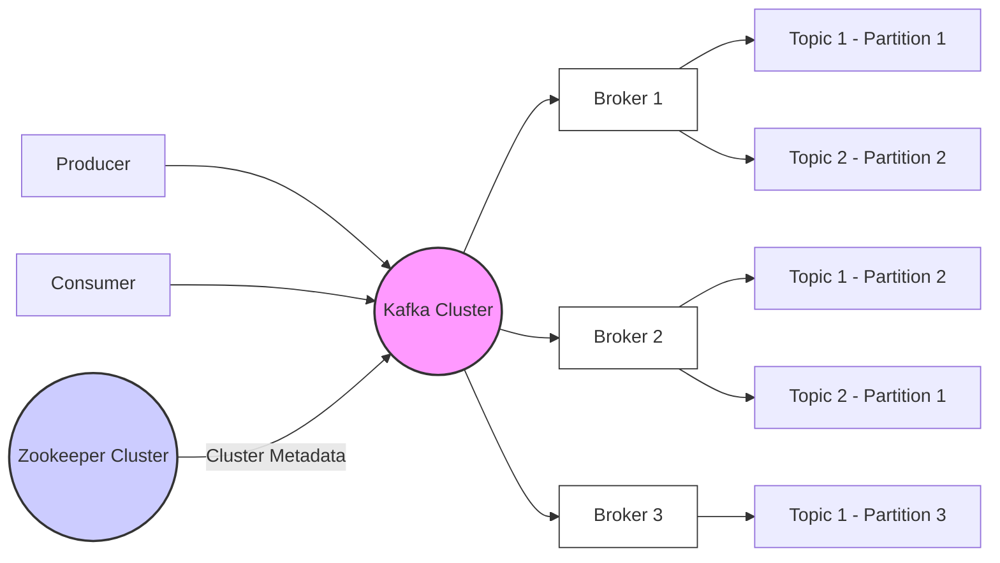

# Apache Kafka Explained: A Comprehensive Guide to Distributed Streaming Platform

In today's data-driven world, processing and managing massive streams of real-time data is crucial. Apache Kafka has emerged as the de facto standard for building real-time data pipelines and streaming applications. This blog post provides a comprehensive overview of Apache Kafka, explaining its core concepts, architecture, and practical usage. Whether you're a beginner or an experienced developer, this guide will equip you with the knowledge you need to leverage the power of Kafka.

## What is Apache Kafka?

Apache Kafka is a distributed, fault-tolerant, high-throughput streaming platform that enables you to build real-time data pipelines and streaming applications. It's designed to handle high volumes of data and provides a scalable and reliable solution for processing data as it's generated. Think of it as a central nervous system for your data, allowing different applications and systems to communicate and share information in real-time.

**Key Characteristics of Kafka:**

- **Distributed:** Kafka operates as a distributed system, meaning it runs on multiple servers (brokers) that work together to provide fault tolerance and scalability.
- **Fault-Tolerant:** Kafka is designed to withstand failures. Data is replicated across multiple brokers, ensuring that data is not lost if a broker goes down.
- **High-Throughput:** Kafka can handle massive amounts of data with low latency. It's optimized for high-volume, real-time data ingestion and processing.
- **Scalable:** Kafka can easily scale to handle increasing data volumes and user loads. You can add more brokers to the cluster to increase capacity.
- **Persistent:** Kafka persists data on disk, allowing consumers to process data at their own pace and replay historical data if needed.
- **Pub-Sub (Publish-Subscribe):** Kafka follows the publish-subscribe messaging pattern, where producers publish data to topics and consumers subscribe to topics to receive data.
- **Event Streaming:** Kafka is designed for continuous data streams, supporting a variety of use cases beyond traditional message queuing.

## Core Concepts of Kafka

To understand how Kafka works, it's essential to grasp its core concepts:

- **Topics:** Topics are categories or feeds to which messages are published. Think of a topic as a table in a database, but instead of storing rows, it stores a stream of messages. Each topic is identified by a unique name within the Kafka cluster.
- **Partitions:** Each topic is divided into one or more partitions. Partitions are ordered, immutable sequences of records. Each record within a partition is assigned a sequential id number, called the offset, that uniquely identifies it within the partition. Partitions allow Kafka to parallelize the processing of data, improving throughput and scalability.
- **Brokers:** Brokers are the servers that make up the Kafka cluster. They are responsible for storing data, handling client requests, and managing the overall cluster. Each broker can host multiple partitions of different topics.
- **Producers:** Producers are applications or systems that publish data to Kafka topics. They send messages to a specific topic, and Kafka takes care of distributing the messages to the appropriate partitions.
- **Consumers:** Consumers are applications or systems that subscribe to Kafka topics and process the data that is published to them. Consumers can subscribe to one or more topics and receive all the messages published to those topics.
- **Zookeeper:** Kafka relies on Zookeeper for cluster management and coordination. Zookeeper is a distributed coordination service that helps Kafka manage broker membership, topic configuration, and consumer group coordination. Zookeeper stores metadata about the Kafka cluster, but the actual message data is stored in the Kafka brokers.
- **Consumer Groups:** Consumers typically organize themselves into consumer groups. Each consumer within a consumer group processes a unique subset of the partitions of a topic. This allows for parallel consumption and scaling of consumer applications. If a single consumer subscribes to a topic, it will consume all messages. If multiple consumers subscribe to the same topic but belong to _different_ consumer groups, each consumer will consume all messages published to the topic (like in a pub-sub system). If multiple consumers subscribe to the same topic _and_ belong to the _same_ consumer group, messages are distributed among the consumers in the group, and each message is only processed by one consumer.

## Kafka Architecture

The following diagram illustrates the typical architecture of a Kafka cluster:



**Explanation:**

- **Producers** send data to the Kafka cluster.
- **Consumers** read data from the Kafka cluster.
- The **Kafka Cluster** consists of multiple **Brokers**.
- **Zookeeper** manages the cluster metadata.
- Topics are divided into **Partitions** and distributed across brokers.

## How Kafka Works: A Step-by-Step Guide

1.  **Producer Publishes Data:** A producer sends a message to a specific topic. The producer doesn't need to know which broker hosts the partition for that topic. The Kafka client library handles the routing.
2.  **Kafka Appends to Partition:** The Kafka broker receives the message and appends it to the end of the appropriate partition. The message is assigned a unique offset.
3.  **Data Replication (Optional):** If replication is enabled (which it usually is), the message is replicated to other brokers that host replicas of the partition. This ensures fault tolerance.
4.  **Consumer Subscribes to Topic:** A consumer subscribes to a specific topic and consumer group.
5.  **Kafka Assigns Partitions:** Kafka assigns partitions to consumers within the consumer group. Each partition is only consumed by one consumer within the group.
6.  **Consumer Reads Data:** The consumer reads messages from the assigned partitions, starting from a specific offset.
7.  **Offset Management:** As the consumer processes messages, it commits (or acknowledges) the offsets of the messages it has processed. This allows the consumer to resume processing from where it left off if it crashes or restarts.

## Practical Examples: Code Snippets

Let's look at some code examples demonstrating how to interact with Kafka using the `kafka-python` library. First, you'll need to install the library:

```bash
pip install kafka-python
```

### 1. Producing Messages

```plaintext
from kafka import KafkaProducer
import json

# Configure the producer
producer = KafkaProducer(
    bootstrap_servers=['localhost:9092'],  # Replace with your Kafka broker(s)
    value_serializer=lambda x: json.dumps(x).encode('utf-8') # Serialize messages as JSON
)

# Send messages to a topic
topic_name = 'my-topic'
for i in range(10):
    message = {'key': 'value', 'number': i}
    producer.send(topic_name, message)
    print(f"Sent message: {message}")

# Ensure all messages are sent
producer.flush()
```

**Explanation:**

- `KafkaProducer` creates a producer instance.
- `bootstrap_servers` specifies the Kafka brokers.
- `value_serializer` defines how to serialize messages before sending them (here, we use JSON).
- `producer.send()` sends a message to the specified topic.
- `producer.flush()` ensures that all buffered messages are sent.

### 2. Consuming Messages

```plaintext
from kafka import KafkaConsumer
import json

# Configure the consumer
consumer = KafkaConsumer(
    'my-topic',  # Subscribe to the topic
    bootstrap_servers=['localhost:9092'],  # Replace with your Kafka broker(s)
    auto_offset_reset='earliest', # Start consuming from the earliest available offset
    enable_auto_commit=True,     # Automatically commit offsets
    group_id='my-group',          # Consumer group ID
    value_deserializer=lambda x: json.loads(x.decode('utf-8')) # Deserialize messages from JSON
)

# Consume messages
for message in consumer:
    print(f"Received message: {message.value}")
```

**Explanation:**

- `KafkaConsumer` creates a consumer instance.
- `'my-topic'` specifies the topic to subscribe to.
- `bootstrap_servers` specifies the Kafka brokers.
- `auto_offset_reset='earliest'` tells the consumer to start from the beginning of the topic if no offset has been committed yet. You can also use `'latest'` to only consume new messages.
- `enable_auto_commit=True` automatically commits offsets, so the consumer doesn't re-process messages if it restarts. For more control, you can set this to `False` and manually commit offsets using `consumer.commit()`.
- `group_id` specifies the consumer group ID. Consumers with the same group ID will share the consumption of the topic's partitions.
- `value_deserializer` defines how to deserialize messages after receiving them (here, we use JSON).

### 3. Creating a Topic (requires `kafka-python` admin client and Kafka server tools)

```plaintext
from kafka.admin import KafkaAdminClient, NewTopic

admin_client = KafkaAdminClient(
    bootstrap_servers="localhost:9092",
    client_id='test'
)

topic_list = []
topic_list.append(NewTopic(name="my-new-topic", num_partitions=3, replication_factor=1))
try:
    admin_client.create_topics(new_topics=topic_list, validate_only=False)
    print("Topic 'my-new-topic' created successfully.")
except Exception as e:
    print(f"Error creating topic: {e}")

```

**Explanation:**

- This code requires `kafka-python` to be installed with the `admin` extra: `pip install kafka-python[admin]`
- `KafkaAdminClient` is used to connect to the Kafka cluster and perform administrative tasks.
- `NewTopic` defines the topic you want to create, including its name, number of partitions, and replication factor.
- `admin_client.create_topics` creates the topic in the Kafka cluster.
- **Important Note:** For local development with a single Kafka broker, set `replication_factor=1`. In production, you should have a higher replication factor (e.g., 3) for fault tolerance.

## Use Cases for Apache Kafka

Kafka's versatility makes it suitable for a wide range of use cases:

- **Real-time Data Pipelines:** Building pipelines to ingest, process, and transform data from various sources in real-time.
- **Event Streaming:** Capturing and processing streams of events, such as user activity, sensor data, and financial transactions.
- **Log Aggregation:** Collecting logs from multiple servers and applications for centralized monitoring and analysis.
- **Metrics Collection:** Gathering metrics from various systems and applications for performance monitoring and alerting.
- **Commit Log:** Using Kafka as a commit log for distributed databases and microservices.
- **Real-time Analytics:** Performing real-time analytics on streaming data to gain insights and make informed decisions.
- **Microservices Communication:** Facilitating communication between microservices using a publish-subscribe messaging pattern.
- **IoT (Internet of Things):** Ingesting and processing data from IoT devices in real-time.

## Advantages of Using Kafka

- **Scalability:** Kafka can handle massive data volumes and user loads.
- **Fault Tolerance:** Data is replicated across multiple brokers, ensuring data is not lost if a broker goes down.
- **High Throughput:** Kafka is optimized for high-volume, low-latency data processing.
- **Persistence:** Data is persisted on disk, allowing consumers to process data at their own pace.
- **Real-time Processing:** Kafka enables real-time data processing and analytics.
- **Flexibility:** Kafka can be used for a wide range of use cases.
- **Integration:** Kafka integrates well with other big data technologies, such as Apache Spark, Apache Flink, and Apache Hadoop.
- **Open Source:** Kafka is open-source software, allowing you to use and modify it freely.

## Considerations and Challenges

While Kafka offers numerous benefits, it's important to be aware of potential challenges:

- **Complexity:** Setting up and managing a Kafka cluster can be complex, especially for large-scale deployments.
- **Zookeeper Dependency:** Kafka relies on Zookeeper, which can be a point of failure and requires careful management. (Note: Kafka is moving away from Zookeeper in newer versions - see below.)
- **Configuration:** Configuring Kafka properly is crucial for performance and reliability.
- **Monitoring:** Monitoring the Kafka cluster is essential to ensure it's running smoothly and to identify potential issues.
- **Security:** Securing a Kafka cluster requires careful planning and implementation.

## Kafka Without Zookeeper: Kraft

Kafka has traditionally relied on Apache Zookeeper for cluster management and coordination. However, the Zookeeper dependency has been a source of complexity and operational overhead. To address this, the Kafka community has developed **Kraft (Kafka Raft Metadata Mode)**, a new consensus mechanism that replaces Zookeeper.

**Benefits of Kraft:**

- **Simplified Architecture:** Eliminates the Zookeeper dependency, simplifying the overall architecture and reducing operational complexity.
- **Improved Scalability:** Kraft is designed to scale to larger clusters with improved performance.
- **Faster Controller Failover:** Kraft provides faster failover of the Kafka controller, improving cluster availability.
- **Reduced Operational Overhead:** Kraft reduces the operational overhead associated with managing Zookeeper.

Kraft is being actively developed and adopted, and it represents the future of Kafka cluster management. When starting new Kafka deployments, consider using Kraft for a simpler and more scalable solution.

## Conclusion

Apache Kafka is a powerful and versatile streaming platform that enables you to build real-time data pipelines and streaming applications. By understanding its core concepts, architecture, and practical usage, you can leverage Kafka to solve a wide range of data-related challenges. As you embark on your Kafka journey, remember to consider the trade-offs and challenges involved and choose the right configuration for your specific use case. With its continuous evolution and the introduction of Kraft, Kafka is poised to remain a leading platform for real-time data processing for years to come. Happy streaming!
