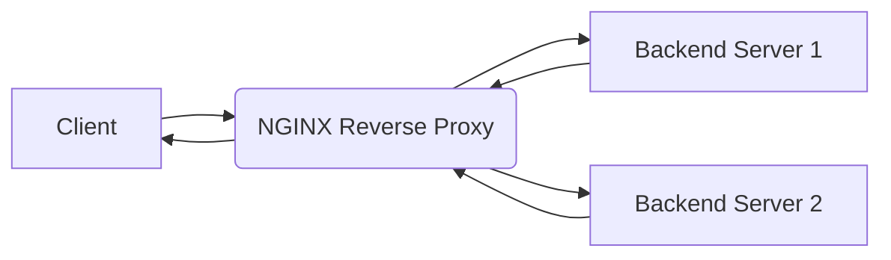

# Configure NGINX as a Reverse Proxy: A Comprehensive Guide

NGINX is a powerful and versatile web server that is commonly used as a reverse proxy, load balancer, HTTP cache, and more. In this comprehensive guide, we will walk you through the process of configuring NGINX as a reverse proxy to improve your web server's performance, security, and manageability.

## What is a Reverse Proxy?

A reverse proxy sits in front of one or more backend servers, intercepts client requests, and forwards them to the appropriate server. The backend servers then process the requests and send the responses back to the reverse proxy, which then forwards them to the client.

Here's a simple illustration:



In this diagram:

- `A` represents the client making a request.
- `B` is the NGINX reverse proxy, which receives the client's request.
- `C` and `D` are the backend servers that actually process the request.

From the client's perspective, it is communicating directly with the NGINX server. The client is unaware of the existence or location of the backend servers.

## Why Use a Reverse Proxy?

Using NGINX as a reverse proxy provides several benefits:

- **Improved Security:** Hides the internal structure of your server infrastructure from the outside world. Clients only interact with the proxy server, making it harder for attackers to directly target your backend servers. You can also configure NGINX to handle SSL/TLS encryption, offloading this resource-intensive task from your backend servers.

- **Load Balancing:** Distributes client requests across multiple backend servers, preventing any single server from becoming overloaded and improving overall performance and availability.

- **Caching:** Caches static content such as images, CSS files, and JavaScript files, reducing the load on your backend servers and improving page load times.

- **SSL/TLS Termination:** NGINX can handle SSL/TLS encryption and decryption, freeing up backend servers to focus on processing application logic. This is also known as SSL Offloading.

- **Centralized Access Control:** NGINX can be configured to enforce access control policies, such as authentication and authorization, before forwarding requests to backend servers.

- **URL Rewriting and Redirection:** NGINX can rewrite URLs and redirect requests, making it easier to manage your website's structure and improve SEO.

## Prerequisites

Before you start, make sure you have the following:

- A server with NGINX installed. You can usually install NGINX with your distribution's package manager (e.g., `apt` on Debian/Ubuntu, `yum` on CentOS/RHEL, `brew` on macOS).
- One or more backend servers that you want to proxy requests to. These could be web servers, application servers, or other types of services.
- Basic knowledge of NGINX configuration.

## Configuring NGINX as a Reverse Proxy

Here's a step-by-step guide to configuring NGINX as a reverse proxy:

1.  **Open the NGINX Configuration File:**

    The main NGINX configuration file is typically located at `/etc/nginx/nginx.conf`. However, it's best practice to create a separate configuration file for each website or application in the `/etc/nginx/conf.d/` directory (or `/etc/nginx/sites-available/` and `/etc/nginx/sites-enabled/`). We'll assume you're using the `conf.d` directory for this example. Let's create a configuration file named `mywebsite.conf`:

    ```plaintext
    sudo nano /etc/nginx/conf.d/mywebsite.conf
    ```

2.  **Create a Server Block:**

    A server block (also known as a virtual host) defines how NGINX handles requests for a specific domain or IP address. Add the following server block to your configuration file:

    ```nginx
    server {
        listen 80;
        server_name example.com www.example.com; # Replace with your domain name

        location / {
            proxy_pass http://backend_server;  # Replace with your backend server's address
            proxy_set_header Host $host;
            proxy_set_header X-Real-IP $remote_addr;
            proxy_set_header X-Forwarded-For $proxy_add_x_forwarded_for;
            proxy_set_header X-Forwarded-Proto $scheme;
        }
    }
    ```

    Let's break down the configuration:

    - `listen 80;`: Specifies that NGINX should listen for incoming requests on port 80 (the standard HTTP port). You'll want to configure for port 443 for HTTPS as well.

    - `server_name example.com www.example.com;`: Defines the domain names that this server block should handle. Replace `example.com` with your actual domain name.

    - `location / { ... }`: Defines the configuration for all requests under the root path (`/`). This means that any request to your domain will be handled by this location block.

    - `proxy_pass http://backend_server;`: This is the key directive that tells NGINX to forward requests to the backend server. `http://backend_server` should be replaced with the address of your backend server. This can be an IP address or a hostname. For example, `http://192.168.1.100:8080` or `http://internal-app-server`.

    - `proxy_set_header Host $host;`: Sets the `Host` header to the original hostname requested by the client. This is important for virtual hosting on the backend server, so it knows which website to serve.

    - `proxy_set_header X-Real-IP $remote_addr;`: Sets the `X-Real-IP` header to the client's IP address. This allows your backend server to see the actual IP address of the client, rather than the IP address of the NGINX server.

    - `proxy_set_header X-Forwarded-For $proxy_add_x_forwarded_for;`: Sets the `X-Forwarded-For` header to a comma-separated list of IP addresses, including the client's IP address and the IP addresses of any intermediate proxies. This allows your backend server to trace the path of the request.

    - `proxy_set_header X-Forwarded-Proto $scheme;`: Sets the `X-Forwarded-Proto` header to either `http` or `https`, depending on the protocol used by the client to connect to the NGINX server. This allows your backend server to know whether the client is using a secure connection.

3.  **Define the Backend Server:**

    You can define the backend server directly in the `proxy_pass` directive, but it's often better to use an upstream block. This allows you to easily configure multiple backend servers for load balancing. Add the following upstream block to the top of your configuration file, _before_ the `server` block:

    ```nginx
    upstream backend_server {
        server 192.168.1.100:8080;  # Replace with your backend server's address
        server 192.168.1.101:8080;  # Add more servers for load balancing
    }
    ```

    Now, in the `server` block, you can use the upstream name:

    ```nginx
    server {
        listen 80;
        server_name example.com www.example.com;

        location / {
            proxy_pass http://backend_server;
            proxy_set_header Host $host;
            proxy_set_header X-Real-IP $remote_addr;
            proxy_set_header X-Forwarded-For $proxy_add_x_forwarded_for;
            proxy_set_header X-Forwarded-Proto $scheme;
        }
    }
    ```

    This configuration forwards requests to either `192.168.1.100:8080` or `192.168.1.101:8080`, distributing the load between them.

4.  **Enable the Configuration:**

    If you created the configuration file in `/etc/nginx/sites-available/`, you need to create a symbolic link to enable it in `/etc/nginx/sites-enabled/`:

    ```plaintext
    sudo ln -s /etc/nginx/sites-available/mywebsite.conf /etc/nginx/sites-enabled/
    ```

    If you created the configuration file in `/etc/nginx/conf.d/`, no further enabling is needed as long as `include /etc/nginx/conf.d/*.conf;` exists in your `nginx.conf` file.

5.  **Test and Reload Nginx:**

    Before restarting NGINX, it's crucial to test your configuration for syntax errors:

    ```plaintext
    sudo nginx -t
    ```

    If the test is successful, reload NGINX to apply the changes:

    ```plaintext
    sudo systemctl reload nginx
    ```

    Or, if you're using an older system:

    ```plaintext
    sudo service nginx reload
    ```

6.  **Verify the Configuration:**

    Open your web browser and visit your domain name (`example.com`). You should see the content served by your backend server. You can also check the NGINX access logs (typically located at `/var/log/nginx/access.log`) to verify that requests are being proxied correctly.

## Advanced Configuration Options

Here are some advanced configuration options that you can use to customize your NGINX reverse proxy:

- **SSL/TLS Configuration:**

  To configure NGINX to handle SSL/TLS encryption, you'll need to obtain an SSL certificate and configure the `listen` directive to use port 443. You'll also need to specify the paths to your SSL certificate and private key.

  ```nginx
  server {
      listen 443 ssl;
      server_name example.com www.example.com;

      ssl_certificate /etc/nginx/ssl/example.com.crt;
      ssl_certificate_key /etc/nginx/ssl/example.com.key;

      location / {
          proxy_pass http://backend_server;
          proxy_set_header Host $host;
          proxy_set_header X-Real-IP $remote_addr;
          proxy_set_header X-Forwarded-For $proxy_add_x_forwarded_for;
          proxy_set_header X-Forwarded-Proto $scheme;
      }
  }
  ```

- **Caching:**

  You can configure NGINX to cache static content such as images, CSS files, and JavaScript files. This can significantly improve performance and reduce the load on your backend servers.

  ```nginx
  proxy_cache_path /tmp/nginx_cache levels=1:2 keys_zone=my_cache:10m max_size=10g inactive=60m use_temp_path=off;
  proxy_cache_key "$scheme$request_method$host$request_uri";

  server {
      listen 80;
      server_name example.com www.example.com;

      location / {
          proxy_pass http://backend_server;
          proxy_set_header Host $host;
          proxy_set_header X-Real-IP $remote_addr;
          proxy_set_header X-Forwarded-For $proxy_add_x_forwarded_for;
          proxy_set_header X-Forwarded-Proto $scheme;

          proxy_cache my_cache;
          proxy_cache_valid 200 302 60m;
          proxy_cache_valid 404 1m;
          proxy_cache_use_stale error timeout invalid_header updating;
          add_header X-Cache-Status $upstream_cache_status;
      }
  }
  ```

- **Load Balancing Algorithms:**

  NGINX supports several load balancing algorithms, including round-robin, least connection, and IP hash. You can specify the algorithm in the `upstream` block.

  ```nginx
  upstream backend_server {
      #Round Robin (default)
      server 192.168.1.100:8080;
      server 192.168.1.101:8080;

      #Least Connection
      #least_conn;
      #server 192.168.1.100:8080;
      #server 192.168.1.101:8080;

      #IP Hash
      #ip_hash;
      #server 192.168.1.100:8080;
      #server 192.168.1.101:8080;
  }
  ```

- **Health Checks:**

  You can configure NGINX to periodically check the health of your backend servers and automatically remove unhealthy servers from the load balancing pool. This is accomplished with the `ngx_http_upstream_module`. This is a more involved configuration and typically requires NGINX Plus or Lua scripting.

## Troubleshooting

If you encounter problems, here are some tips:

- **Check the NGINX error logs:** The NGINX error logs (typically located at `/var/log/nginx/error.log`) can provide valuable information about errors and warnings.
- **Test your configuration:** Use the `nginx -t` command to test your configuration for syntax errors.
- **Verify your backend server:** Make sure your backend server is running and accessible.
- **Check your firewall:** Make sure your firewall is not blocking traffic to or from the NGINX server or the backend server.
- **Use `curl` or `wget`:** Use `curl` or `wget` to test the connection to your backend server and the NGINX server directly. This can help you isolate the problem.

## Conclusion

Configuring NGINX as a reverse proxy can significantly improve your web server's performance, security, and manageability. By following the steps outlined in this guide, you can easily set up NGINX to forward requests to your backend servers and take advantage of its powerful features. Remember to always test your configuration thoroughly and monitor your logs for errors. Good luck!
