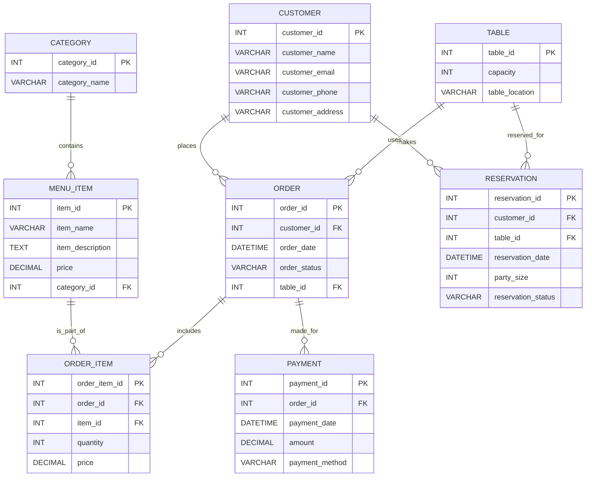

# Designing a Database Schema for a Restaurant Management System: A Comprehensive Guide

Running a restaurant efficiently requires a well-organized system, and at the heart of that system lies a robust database.  This post provides a comprehensive guide to designing a database schema for a restaurant management system. We'll cover key entities like menus, orders, customers, and payments, and provide SQL examples to illustrate how these components interact.  We will also discuss how to create an Entity-Relationship Diagram (ERD) to visually represent the database structure.

## Why is a Well-Designed Database Important?

A well-designed database is crucial for:

*   **Efficiency:** Faster data retrieval and processing.
*   **Accuracy:** Reduced errors and data inconsistencies.
*   **Scalability:** Ability to handle increasing data volume as the restaurant grows.
*   **Maintainability:** Easier to update and modify the system over time.
*   **Reporting:**  Facilitates generating meaningful reports on sales, customer preferences, and inventory.

## Key Entities and Relationships

Here's a breakdown of the core entities in our restaurant management system and the relationships between them:

*   **Customers:** Information about regular and occasional diners.
*   **Menu Items:** Details about each dish or drink offered.
*   **Categories:** Grouping of menu items (e.g., Appetizers, Entrees, Desserts).
*   **Orders:** Records of customer orders, including items ordered, quantities, and timestamps.
*   **Order Items:**  A breakdown of each individual item within an order.
*   **Payments:** Records of payments received from customers.
*   **Tables:** Information about available tables in the restaurant.
*   **Reservations:** Records of customer reservations for specific tables and times.

## Entity-Relationship Diagram (ERD)

While a full ERD would be quite large, here's a simplified representation to illustrate the core relationships:



**Explanation of Relationships:**

*   **One-to-Many `(||--o{)`:**  A customer can place many orders.  A category can contain many menu items.  An order can include many order items.
*   **Foreign Keys (FK):**  Connect related tables (e.g., `customer_id` in `ORDER` references `customer_id` in `CUSTOMER`).
*   **Primary Keys (PK):**  Uniquely identify each record in a table.

## Database Schema (SQL Examples)

Here are SQL examples to create the tables in our restaurant database.  These examples are compatible with most SQL databases, including MySQL and PostgreSQL.  We'll use generic SQL, but you might need to adjust data types slightly based on your chosen database system.

**1. Customers Table:**

```sql
CREATE TABLE Customers (
    customer_id INT PRIMARY KEY AUTO_INCREMENT,
    customer_name VARCHAR(255) NOT NULL,
    customer_email VARCHAR(255) UNIQUE,
    customer_phone VARCHAR(20),
    customer_address VARCHAR(255),
    loyalty_points INT DEFAULT 0  -- Add loyalty points if you have a loyalty program
);
```

**2. Menu Items Table:**

```sql
CREATE TABLE MenuItems (
    item_id INT PRIMARY KEY AUTO_INCREMENT,
    item_name VARCHAR(255) NOT NULL,
    item_description TEXT,
    price DECIMAL(10, 2) NOT NULL,
    category_id INT,
    image_url VARCHAR(255), -- Optionally store image URLs
    FOREIGN KEY (category_id) REFERENCES Categories(category_id)
);
```

**3. Categories Table:**

```sql
CREATE TABLE Categories (
    category_id INT PRIMARY KEY AUTO_INCREMENT,
    category_name VARCHAR(255) NOT NULL
);
```

**4. Orders Table:**

```sql
CREATE TABLE Orders (
    order_id INT PRIMARY KEY AUTO_INCREMENT,
    customer_id INT,
    order_date DATETIME DEFAULT CURRENT_TIMESTAMP,
    order_status VARCHAR(50) DEFAULT 'Pending', -- e.g., 'Pending', 'Confirmed', 'Preparing', 'Delivered', 'Cancelled'
    table_id INT,
    total_amount DECIMAL(10,2) DEFAULT 0.00,
    notes TEXT, -- Any special instructions from the customer
    FOREIGN KEY (customer_id) REFERENCES Customers(customer_id),
    FOREIGN KEY (table_id) REFERENCES Tables(table_id)
);
```

**5. Order Items Table:**

```sql
CREATE TABLE OrderItems (
    order_item_id INT PRIMARY KEY AUTO_INCREMENT,
    order_id INT,
    item_id INT,
    quantity INT NOT NULL,
    price DECIMAL(10, 2) NOT NULL, -- Store the price at the time of the order
    FOREIGN KEY (order_id) REFERENCES Orders(order_id),
    FOREIGN KEY (item_id) REFERENCES MenuItems(item_id)
);
```

**6. Payments Table:**

```sql
CREATE TABLE Payments (
    payment_id INT PRIMARY KEY AUTO_INCREMENT,
    order_id INT,
    payment_date DATETIME DEFAULT CURRENT_TIMESTAMP,
    amount DECIMAL(10, 2) NOT NULL,
    payment_method VARCHAR(50), -- e.g., 'Cash', 'Credit Card', 'Debit Card'
    transaction_id VARCHAR(255), -- Optional: For tracking credit card transactions
    FOREIGN KEY (order_id) REFERENCES Orders(order_id)
);
```

**7. Tables Table:**

```sql
CREATE TABLE Tables (
    table_id INT PRIMARY KEY AUTO_INCREMENT,
    capacity INT NOT NULL,
    table_location VARCHAR(255), -- e.g., 'Patio', 'Indoor', 'Bar'
    is_available BOOLEAN DEFAULT TRUE
);
```

**8. Reservations Table:**

```sql
CREATE TABLE Reservations (
    reservation_id INT PRIMARY KEY AUTO_INCREMENT,
    customer_id INT,
    table_id INT,
    reservation_date DATETIME NOT NULL,
    party_size INT NOT NULL,
    reservation_status VARCHAR(50) DEFAULT 'Confirmed',  -- e.g., 'Confirmed', 'Checked In', 'Cancelled', 'No Show'
    notes TEXT,  -- Any special requests or notes
    FOREIGN KEY (customer_id) REFERENCES Customers(customer_id),
    FOREIGN KEY (table_id) REFERENCES Tables(table_id)
);
```

**Important Considerations:**

*   **Data Types:** Choose appropriate data types for each column.  `VARCHAR` for strings, `INT` for integers, `DECIMAL` for monetary values, and `DATETIME` for dates and times.
*   **Constraints:** Use `NOT NULL` to enforce required fields and `UNIQUE` to ensure uniqueness (e.g., email addresses).
*   **Indexes:**  Add indexes to frequently queried columns (e.g., `customer_id` in `Orders`, `item_id` in `OrderItems`) to improve performance. You can create indexes using the `CREATE INDEX` statement.  However, be careful not to over-index, as this can slow down write operations.
*   **Normalization:**  Ensure your schema is normalized to reduce data redundancy and improve data integrity. This involves breaking down tables into smaller, more manageable units and defining relationships between them.
*   **Database Technology:** Choose a database system that meets your needs.  MySQL, PostgreSQL, MariaDB, and SQLite are popular choices.
*   **Security:** Implement proper security measures to protect your data from unauthorized access.  This includes setting up appropriate user permissions and encrypting sensitive data.

## Example Queries

Here are some example SQL queries to illustrate how to retrieve data from the database:

**1. Get all orders placed by a specific customer:**

```sql
SELECT * FROM Orders WHERE customer_id = 123;
```

**2. Get the menu items in a specific category:**

```sql
SELECT * FROM MenuItems WHERE category_id = 4;
```

**3. Get the total amount paid for a specific order:**

```sql
SELECT SUM(amount) FROM Payments WHERE order_id = 456;
```

**4.  Get the most popular menu item (most frequently ordered):**

```sql
SELECT mi.item_name, COUNT(*) AS order_count
FROM OrderItems oi
JOIN MenuItems mi ON oi.item_id = mi.item_id
GROUP BY mi.item_id
ORDER BY order_count DESC
LIMIT 1;
```

**5. Get reservations for a specific date:**

```sql
SELECT c.customer_name, t.table_location, r.reservation_date, r.party_size
FROM Reservations r
JOIN Customers c ON r.customer_id = c.customer_id
JOIN Tables t ON r.table_id = t.table_id
WHERE DATE(r.reservation_date) = '2024-10-28';
```

## Expanding the Schema

This schema can be further expanded to include features such as:

*   **Inventory Management:** Tracking ingredient quantities and managing stock levels.
*   **Employee Management:** Storing employee information, schedules, and payroll data.
*   **Customer Loyalty Programs:**  More sophisticated loyalty point systems and rewards.
*   **Delivery Management:**  Integrating with delivery services and tracking delivery orders.
*   **Discounts and Promotions:** Managing discount codes and promotional offers.

## Conclusion

Designing a well-structured database is fundamental for building a robust and efficient restaurant management system. By understanding the core entities, relationships, and implementing a normalized schema, you can ensure data integrity, improve performance, and create a system that can scale with your restaurant's growth.  Remember to tailor the schema to your specific needs and consider future expansion possibilities.  This guide provides a solid foundation for creating a database that will help you manage your restaurant effectively.